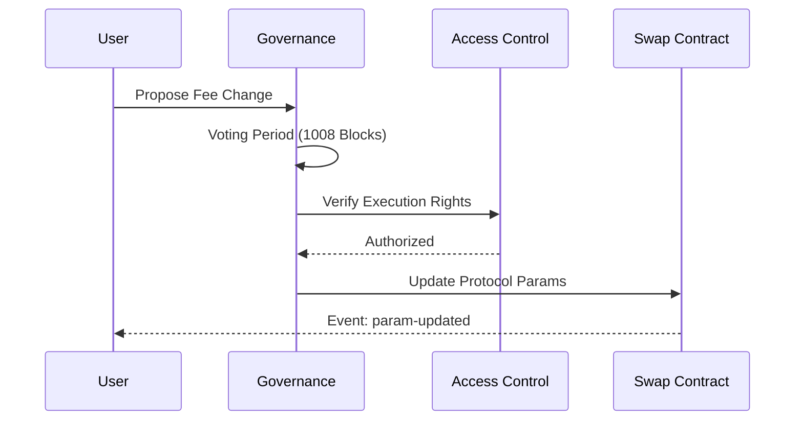

# StacksRank Protocol Architecture

## 🏅 Built for Stacks Builder Rewards

**StacksRank** is architecturally designed to maximize your leaderboard position by excelling in all ranking criteria:

1. **Smart Contract Impact**: Advanced Clarity 2.0 contracts with real DeFi logic.
2. **Library Integration**: Deep use of `@stacks/connect` and `@stacks/transactions`.
3. **Public Contributions**: Professional, well-documented public repository.
4. **Security First**: Trait-based security guards and standardized error handling.

---

## System Overview

```mermaid
graph TD
    User((User)) -->|Connects| Wallet[Leather/Xverse Wallet]
    Wallet -->|Interacts| UI[Frontend Layer]
    UI -->|Calls| Connect[@stacks/connect]
    Connect -->|Signs TX| Blockchain[(Stacks Blockchain)]
    
    subgraph "Smart Contract Layer"
        Blockchain --> Reputation[reputation.clar]
        Blockchain --> Swap[advanced-amm.clar]
        Blockchain --> Governance[governance.clar]
        Blockchain --> Access[access-control.clar]
    end
    
    subgraph "Traits & Libraries"
        Reputation -.-> Traits[governance-trait]
        Swap -.-> Traits
        Access -.-> Guard[guard-trait]
        Blockchain -.-> Libs[error-codes.clar]
    end
```

### Core Components

| Component | Purpose | Technical Highlights |
|-----------|---------|----------------------|
| **Reputation** | User engagement tracking | Quadratic scoring, streak-based multipliers |
| **Advanced AMM** | Token liquidity & swaps | slippage protection, multi-hop quoting |
| **Governance** | Protocol parameters | Token-weighted voting, threshold quorum |
| **Access Control** | Protocol security | Role-Based Access Control (RBAC), Global Pause |

---

## Advanced Logic & Algorithms

### 1. Quadratic Reputation Scoring
Standard linear scoring often favors "whales" or single-day activity. StacksRank uses a quadratic formula to reward consistent, long-term participation:

$$Points = Base \times (1 + \frac{Streak^2}{10})$$

*   **Incentive**: Users are heavily incentivized to maintain daily streaks to exponentially grow their reputation weight.
*   **Implementation**: Found in `contracts/simple-reputation.clar`.

### 2. Multi-Hop AMM Quoting
The `advanced-swap.clar` contract supports cross-pool path finding via the `get-multi-hop-quote` function, allowing users to find the best price across synthetic routes.

### 3. Trait-Based Security
All critical contracts implement the `guard-trait`, ensuring a standardized way to pause the protocol during emergencies and verify authorization across distributed modules.



---

## Technology Stack

### Frontend Layer
- **UI**: Modern Glassmorphism (Vanilla CSS)
- **Logic**: ES6+ JavaScript
- **Web3**: Stacks.js 6.0, `@stacks/connect`
- **Analytics**: On-chain event printing for sub-graph indexing

### Smart Contract Layer
- **Language**: Clarity 2.0 (Decidable, interpreted)
- **Standards**: SIP-010 (Tokens), Custom Traits (Security, Gov)
- **Tooling**: Clarinet 2.0 for local simulation and integration testing

---

## Security Model

1. **Input Validation**: Strict `asserts!` on all parameters (length, bounds, types).
2. **Emergency Pause**: Global pause state in `access-control.clar` prevents state changes during exploits.
3. **Atomic Operations**: Post-conditions in Stacks ensure assets are never stolen even if logic is flawed.
4. **Standardized Errors**: Centralized `error-codes.clar` for unambiguous debugging.

---

**Built for Talent Protocol Stacks Event 2026** 🚀  
*Advancing the Stacks ecosystem through modular, secure, and verifiable code.*
