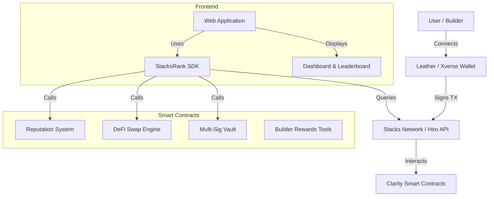

# StacksRank Architecture

StacksRank is a decentralized ranking and DeFi platform built on the Stacks Bitcoin L2.

## System Overview

## Components

### 1. Frontend
A vanilla JS application that provides a responsive interface for interacting with the Stacks ecosystem. It uses the StacksRank SDK for all blockchain interactions.

### 2. StacksRank SDK
A JavaScript library that abstracts the complexity of Clarity contract calls and Hiro API queries. It provides typed interfaces and helper functions for common tasks.

### 3. Clarity Smart Contracts
The core logic of the platform, written in Clarity. These contracts handle reputation tracking, atomic swaps, and treasury management.

## Data Flow
1. User connects their wallet.
2. Frontend queries the Hiro API for the user's on-chain activity.
3. Reputation is calculated based on predefined criteria.
4. User can perform DeFi actions (swap, deposit to vault).
5. Actions are signed by the wallet and broadcast to the Stacks network.
